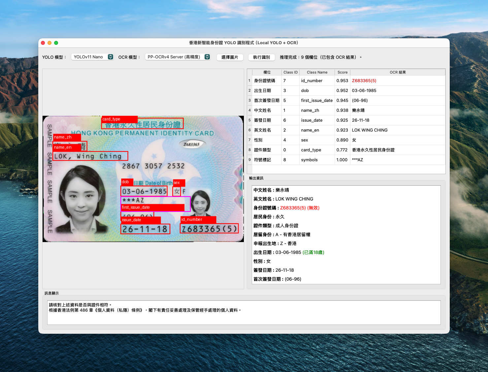
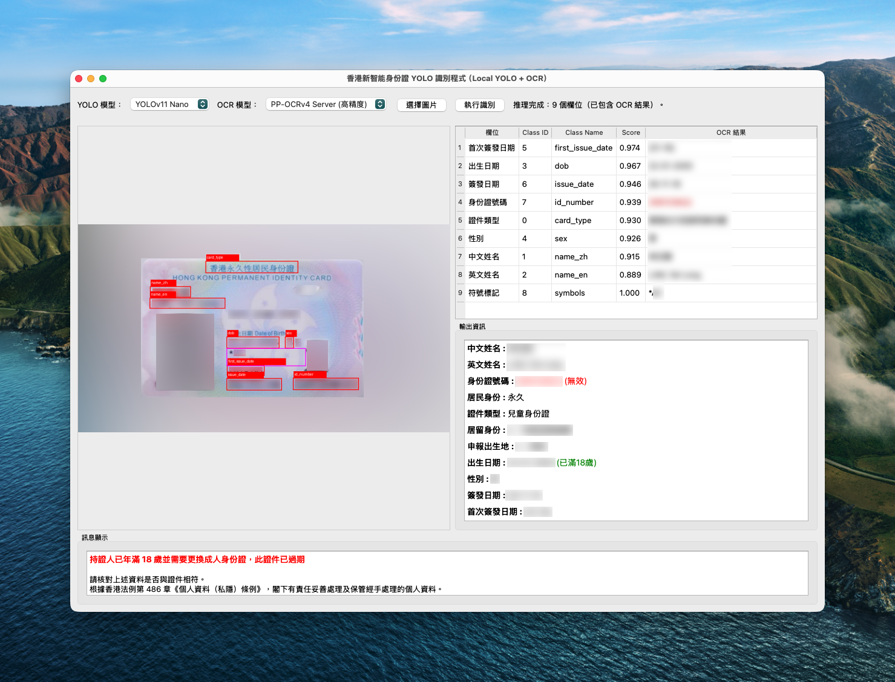

# 香港智能身份證識別系統 (YOLO + OCR)

**繁體中文** | [English](README_en.md)

本項目是一個基於 Python 的桌面程式，專門用於識別香港新智能身份證上的資訊。系統結合了 **YOLOv11** 目標檢測模型與 **PaddleOCR** 文字識別技術，能夠自動定位並讀取身份證上的關鍵欄位，並提供即時的資料驗證與分析功能。

## 📋 項目介紹

此程式提供了一個圖形化介面 (PyQt5)，使用者可以上傳身份證圖片，系統會自動進行以下處理：
1.  使用 YOLO 模型偵測身份證上的各個文字欄位位置。
2.  對偵測到的區域進行裁切與影像前處理。
3.  使用 OCR 技術讀取欄位內容。
4.  對讀取到的資料進行格式化、驗證及邏輯分析（如年齡計算、證件有效性檢查）。

## ✅ 適用範圍

此程式僅支援 2018 年 11 月 26 日或以後開始簽發的新智能身份證

## 🤖 已訓練的 YOLO 模型

此項目包含兩個針對香港智能身份證欄位微調的 YOLOv11 模型，使用者可於介面中自由切換：

*   **YOLOv11 Nano (`hkid_yolo_nano.pt`)**: 輕量級模型，推論速度快，適合一般用途。
*   **YOLOv11 Small (`hkid_yolo_small.pt`)**: 參數量稍大，提供更高的檢測精度。

## 🔍 識別欄位與方式

系統支援識別以下欄位，並針對不同欄位採用了特定的識別策略：

| 欄位名稱 | 識別方式 | 備註 |
| :--- | :--- | :--- |
| **證件標題** | YOLO + OCR | 提取證件標題，例如「香港永久性居民身份證」 |
| **中文姓名** | YOLO + OCR | 自動清除多餘空格 |
| **英文姓名** | YOLO + OCR | 格式化為 `SURNAME, Given Names` |
| **身份證號碼** | YOLO + OCR | 包含括號內的校驗碼，並進行 Check Digit 驗證 |
| **出生日期** | YOLO + OCR | 用於計算年齡 |
| **性別** | YOLO + OCR | |
| **簽發日期** | YOLO + OCR | |
| **首次簽發日期** | YOLO + OCR | |
| **符號標記** | 位置推斷 + OCR | 透過「出生日期」位置推斷下方區域，識別 `***`、`A`、`R` 等符號 |
| **居民身份** | 邏輯推斷 | 綜合「證件類型」文字與「符號標記」（如 `***` 或 `A`）判斷 |
| **證件類型** | 邏輯推斷 | 根據居民身份及星號數量判斷（如永久居民單星為兒童身份證） |
| **居留身份** | 邏輯推斷 | 解析符號標記中的 `A`, `R`, `C`, `U` 代碼 |
| **申報出生地** | 邏輯推斷 | 解析符號標記中的 `Z`, `X`, `W`, `O` 代碼 |

## 🛠️ 其他功能

除了基本的文字識別外，本系統還具備以下智慧功能：

1.  **身份證號碼驗證**：
    *   通過 Check Digit 演算法檢查身份證號碼是否有效。
    *   有效號碼顯示為綠色，無效顯示為紅色。

2.  **即時年齡計算**：
    *   根據「出生日期」與當前日期自動計算持證人年齡。
    *   顯示是否已滿 18 歲。

3.  **過期證件/換證提示**：
    *   若系統偵測到持證人**已年滿 18 歲**，但所持證件被識別為**兒童身份證**，系統會發出紅色警告，提示證件已過期並需要更換成人身份證。

4.  **資料正規化**：
    *   自動將全形字元轉換為半形。
    *   去除多餘空格及雜訊。

## 🚀 開始使用

本專案使用 [`uv`](https://github.com/astral-sh/uv) 作為 Python 專案管理及套件安裝工具。  

如果閣下的操作系統尚未安裝 `uv`，可參照相關官方文件。

### 1. Clone
- ``git clone https://github.com/swpotatoandy/hkid-yolo-ocr.git``
- ``cd hkid-yolo-ocr``

### 2. 安裝 Dependencies
- ``uv sync``

### 3. 執行
- ``uv run hkid_yolo_qt.py``

## 🏞️ 示範圖片

示範一（成人身份證範本）（身份證圖片為香港入境事務處公開示範樣本，不屬於任何真實個人資料。）

示範二（過期兒童身份證，持證人已成年）（模擬資料，非真實證件）

## ⚠️ 免責聲明及法律宣告

1.  **個人資料私隱**：本程式僅供技術研究與學術交流使用。使用者在使用本程式處理任何包含個人資料的圖片（如真實的香港身份證）時，必須嚴格遵守香港法例第 486 章《個人資料（私隱）條例》及相關法律法規。
2.  **資料安全**：本程式為本地運行 (Local Execution)，不會將圖片上傳至任何雲端伺服器。然而，使用者仍有責任確保運行環境的安全性，並妥善保管經手處理的個人資料，開發人員不會對一切資料外洩事件負責。
3.  **準確性**：OCR 識別技術並非 100% 準確，識別結果僅供參考，不應直接用於任何具法律效力的身份核實程序。開發者不對因使用本程式而產生的任何直接或間接損失負責。
4.  **使用建議**：本程式僅適用於學習及研究用途，不建議在商用或任何正式環境使用。
5.  **版權**：本項目中使用的第三方庫及模型（如 Ultralytics YOLO, PaddleOCR）均遵循其各自的開源授權協議。

## 📃 授權 (License)

本項目基於 MIT License 授權方式發佈並公開。你可以自由使用、修改、再散佈本專案的原始碼，包括商業用途，惟必須保留授權聲明。詳細授權條款請參閱本倉庫中的 [LICENSE](LICENSE) 文件。

## 📌 外部依賴及其授權（Third-Party Licenses）

感謝開源社群的貢獻，使本項目得以在此基礎上進行開發與最佳化，本專案使用了多個外部開源工具與模型，這些工具 不屬於 MIT，並遵循各自的授權條款：

### 🔹 Ultralytics YOLOv11

- 官方授權：AGPL-3.0 License
- 原始專案：https://github.com/ultralytics/ultralytics
- Ultralytics 相關模型（例如 YOLOv8 / YOLOv11）是基於 AGPL 授權，使用者需要遵守 AGPL 要求（例如若將模型整合成後端服務，需公開來源碼）。

### 🔹 PaddleOCR（PP-OCRv4 / PP-OCRv3）

- 官方授權：Apache License 2.0
- 原始專案：https://github.com/PaddlePaddle/PaddleOCR

### 🔹 Daniellau119/trad_chineseHKOCR

- 官方授權：Apache License 2.0
- 原始專案：https://huggingface.co/datasets/Daniellau119/trad_chineseHKOCR

---
*Last Updated: 2025-12-11*
