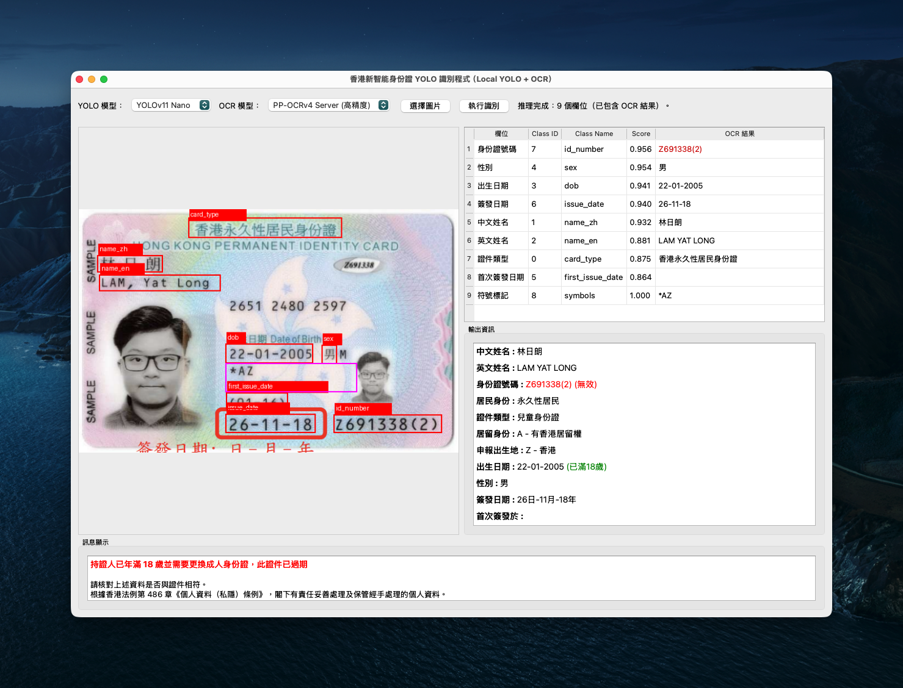
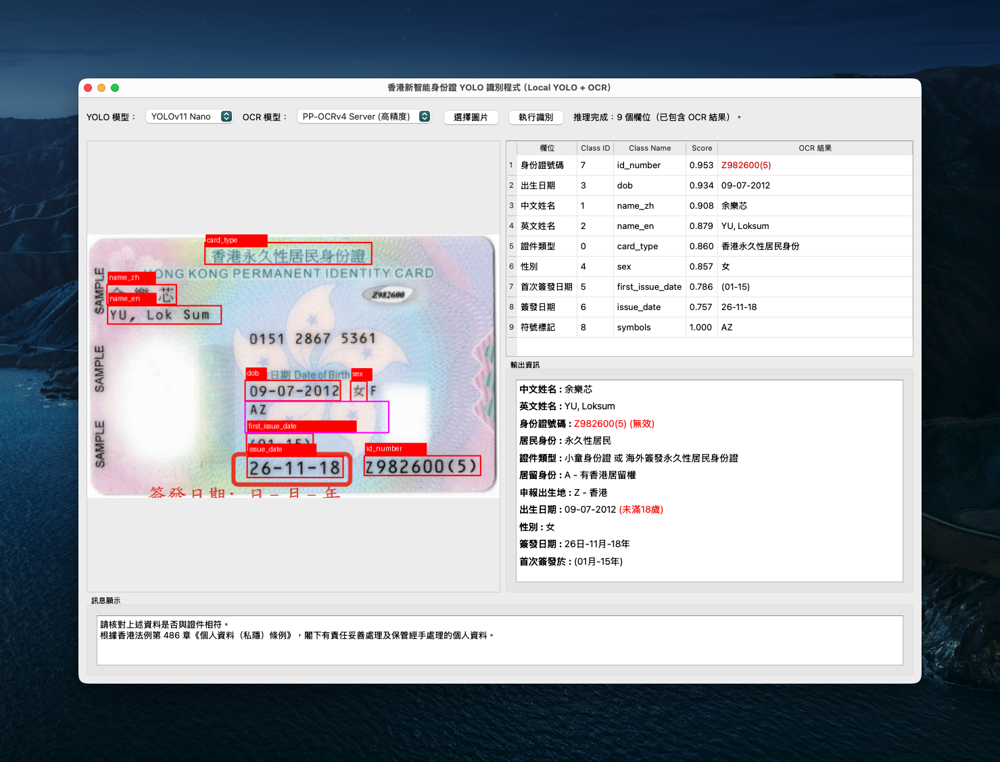
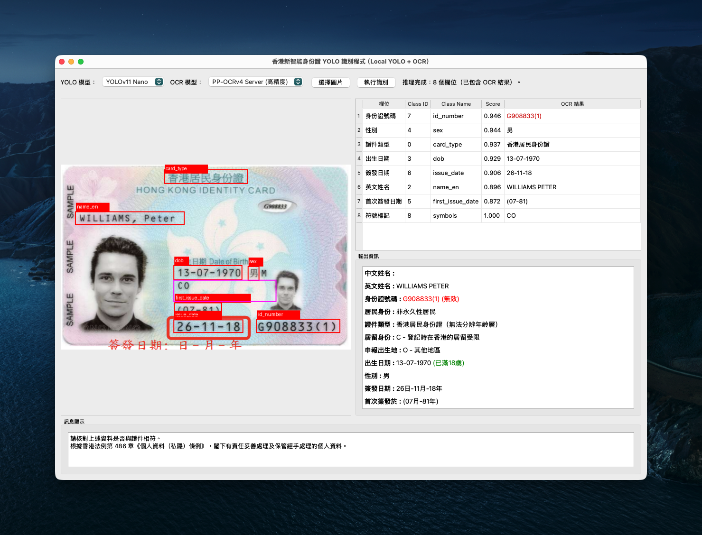
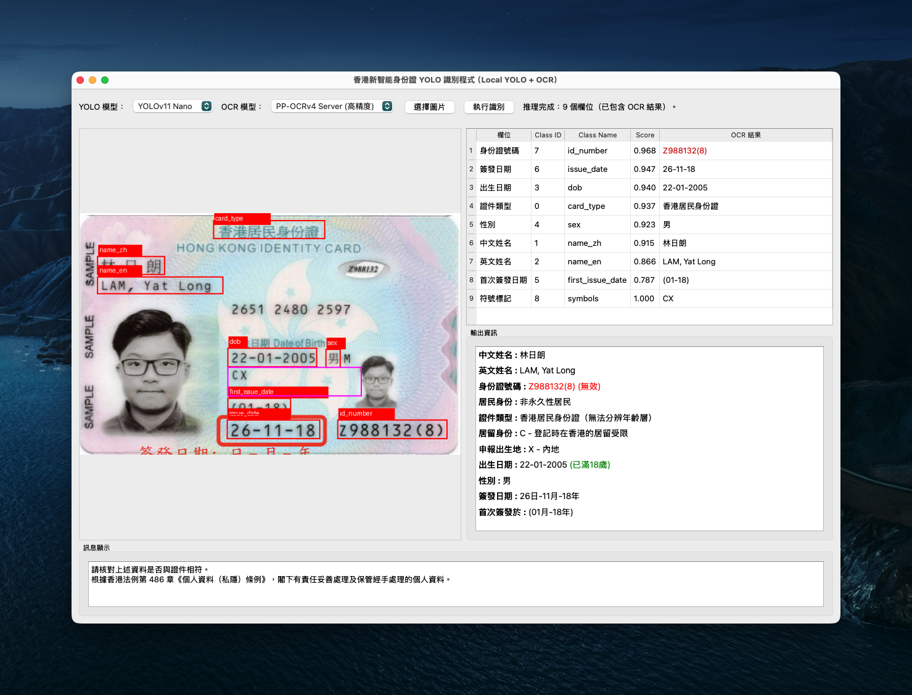

# Hong Kong Smart Identity Card Recognition System (YOLO + OCR)

[繁體中文](README.md) | **English**

***This README file was translated by Google Gemini 3 and has not yet been manually reviewed.***

This project is a Python-based desktop application designed to recognize information on the new Hong Kong Smart Identity Card. The system combines the **YOLOv11** object detection model and **PaddleOCR** text recognition technology to automatically locate and read key fields on the ID card, providing real-time data validation and analysis.

## 📋 Project Introduction

This application provides a graphical user interface (PyQt5) where users can upload ID card images. The system automatically performs the following processing:
1.  Uses the YOLO model to detect the positions of various text fields on the ID card.
2.  Crops and pre-processes the detected regions.
3.  Uses OCR technology to read the field contents.
4.  Formats, validates, and logically analyzes the read data (e.g., age calculation, ID validity check).

## ✅ Scope of Application

This program only supports the following identity cards issued on or after November 26, 2018:

1. Adult Hong Kong Permanent Identity Card
2. Juvenile Hong Kong Permanent Identity Card
3. Minor Hong Kong Permanent Identity Card *
4. Adult Hong Kong Identity Card
5. Juvenile Hong Kong Identity Card
6. Adult/Juvenile Overseas-issued Hong Kong Permanent Identity Card *
7. Minor Overseas-issued Hong Kong Permanent Identity Card *

*As both the Minor Permanent Identity Card and the overseas-issued Permanent Identity Card contain the word "Permanent" and do not have an asterisk symbol, this program cannot distinguish between these types of identity cards.

## 🤖 Trained YOLO Models

This project includes two YOLOv11 models fine-tuned for Hong Kong Smart Identity Card fields, which users can switch between in the interface:

*   **YOLOv11 Nano (`hkid_yolo_nano.pt`)**: Lightweight model, fast inference speed, suitable for general use.
*   **YOLOv11 Small (`hkid_yolo_small.pt`)**: Slightly larger parameter size, providing higher detection accuracy.

## 🔍 Recognition Fields and Methods

The system supports recognition of the following fields and adopts specific recognition strategies for different fields:

| Field Name | Recognition Method | Remarks |
| :--- | :--- | :--- |
| **HKID Title** | YOLO + OCR | Extract the document title, for example, "HONG KONG PERMANENT IDENTITY CARD" |
| **Chinese Name** | YOLO + OCR | Automatically remove extra spaces |
| **English Name** | YOLO + OCR | Formatted as `SURNAME, Given Names` |
| **ID Number** | YOLO + OCR | Includes the check digit in brackets and performs Check Digit validation |
| **Date of Birth** | YOLO + OCR | Used for age calculation |
| **Gender** | YOLO + OCR | |
| **Date of Issue** | YOLO + OCR | |
| **Date of First Registration** | YOLO + OCR | |
| **Symbols** | Location Inference + OCR | Infers the area below "Date of Birth" to recognize symbols like `***`, `A`, `R`, etc. |
| **Residential Status** | Logical Inference | Judged by combining "Card Type" text and "Symbols" (e.g., `***` or `A`) |
| **HKID Type** | Logical Inference | Judged based on residential status and number of asterisks (e.g., Permanent Resident with one asterisk is a Child ID) |
| **Right of Abode** | Logical Inference | Parses `A`, `R`, `C`, `U` codes in the symbols |
| **Place of Birth** | Logical Inference | Parses `Z`, `X`, `W`, `O` codes in the symbols |

## 🛠️ Other Features

In addition to basic text recognition, this system also features the following smart functions:

1.  **ID Number Validation**:
    *   Checks if the ID number is valid using the Check Digit algorithm.
    *   Valid numbers are displayed in green, invalid ones in red.

2.  **Real-time Age Calculation**:
    *   Automatically calculates the holder's age based on "Date of Birth" and the current date.
    *   Displays whether the holder is 18 years old or above.

3.  **Expired ID/Replacement Warning**:
    *   If the system detects that the holder is **18 years old or above** but the ID card is identified as a **Child Identity Card**, a red warning will be issued, prompting that the ID card has expired and needs to be replaced with an Adult Identity Card.

4.  **Data Normalization**:
    *   Automatically converts full-width characters to half-width.
    *   Removes excess spaces and noise.

## 🚀 Getting Started

This project uses [`uv`](https://github.com/astral-sh/uv) as the Python project management and package installation tool.

If your operating system does not have `uv` installed, please refer to the official documentation.

### 1. Clone
- ``git clone https://github.com/swpotatoandy/hkid-yolo-ocr.git``
- ``cd hkid-yolo-ocr``

### 2. Install Dependencies
- ``uv sync``

### 3. Run
- ``uv run hkid_yolo_qt.py``

## 🏞️ Demo Images

Example 1: Adult Hong Kong Permanent Identity Card

Example 2: Juvenile Hong Kong Permanent Identity Card

``The English meaning of the red sentence at the bottom of the screenshot is 'The holder is over 18 years old and needs to renew their adult ID card; this document has expired.'``

Example 3: Minor Hong Kong Permanent Identity Card

Example 4: Adult Hong Kong Identity Card (the holder does not have a Chinese name)

Example 5: Juvenile Hong Kong Identity Card

Example 6: Overseas-issued Adult Hong Kong Permanent Identity Card

**⚠️ Note: All HKID card images above are taken from a [public documents](https://gia.info.gov.hk/general/202509/30/P2025093000197_513643_1_1759197627959.pdf) of the Hong Kong government and do not involve any real personal data.**

## 🚧 Roadmap

1. Enable the program to distinguish whether an ID card contains the holder's photograph, thus differentiating between a Minor ID card and a Hong Kong Permanent ID card issued overseas.
2. Retrain the YOLO model to label the Chinese commercial code portion, thereby improving the accuracy of extracting the holder's Chinese name by decoding the code.
3. Allow users to choose whether to upload images of both the front and back of the ID card simultaneously, and separately train a YOLO model applicable to the back of the ID card, thus addressing the current limitation of not being able to distinguish the age range of non-permanent resident ID card holders.

## ⚠️ Disclaimer and Legal Notice

1.  **Personal Data Privacy**: This program is for technical research and academic exchange only. Users must strictly comply with the Personal Data (Privacy) Ordinance (Cap. 486) and related laws and regulations of Hong Kong when using this program to process any images containing personal data (such as real Hong Kong Identity Cards).
2.  **Data Security**: This program runs locally (Local Execution) and does not upload images to any cloud servers. However, users are still responsible for ensuring the security of the operating environment and properly safeguarding the personal data handled. The developers are not responsible for any data leakage incidents.
3.  **Accuracy**: OCR recognition technology is not 100% accurate. The recognition results are for reference only and should not be directly used for any identity verification procedures with legal effect. The developers are not responsible for any direct or indirect losses caused by the use of this program.
4.  **Usage Recommendation**: This program is suitable for learning and research purposes only and is not recommended for commercial use or any formal environment.
5.  **Copyright**: The third-party libraries and models used in this project (such as Ultralytics YOLO, PaddleOCR) follow their respective open source license agreements.

## 📃 License

This project is released under the MIT License. You are free to use, modify, and redistribute the source code of this project, including for commercial purposes, provided that the license statement is retained. For detailed license terms, please refer to the [LICENSE](LICENSE) file in this repository.

## 📌 Third-Party Licenses

Thanks to the contribution of the open source community, this project can be developed and optimized on this basis. This project uses multiple external open source tools and models, which do not belong to MIT and follow their respective license terms:

### 🔹 Ultralytics YOLOv11

- Official License: AGPL-3.0 License
- Original Project: https://github.com/ultralytics/ultralytics
- Ultralytics related models (e.g., YOLOv8 / YOLOv11) are based on the AGPL license. Users need to comply with AGPL requirements (e.g., if the model is integrated into a backend service, the source code must be disclosed).

### 🔹 PaddleOCR（PP-OCRv4 / PP-OCRv3）

- Official License: Apache License 2.0
- Original Project: https://github.com/PaddlePaddle/PaddleOCR

### 🔹 Daniellau119/trad_chineseHKOCR

- Official License: Apache License 2.0
- Original Project: https://huggingface.co/datasets/Daniellau119/trad_chineseHKOCR

---
*Last Updated: 2025-12-11*
